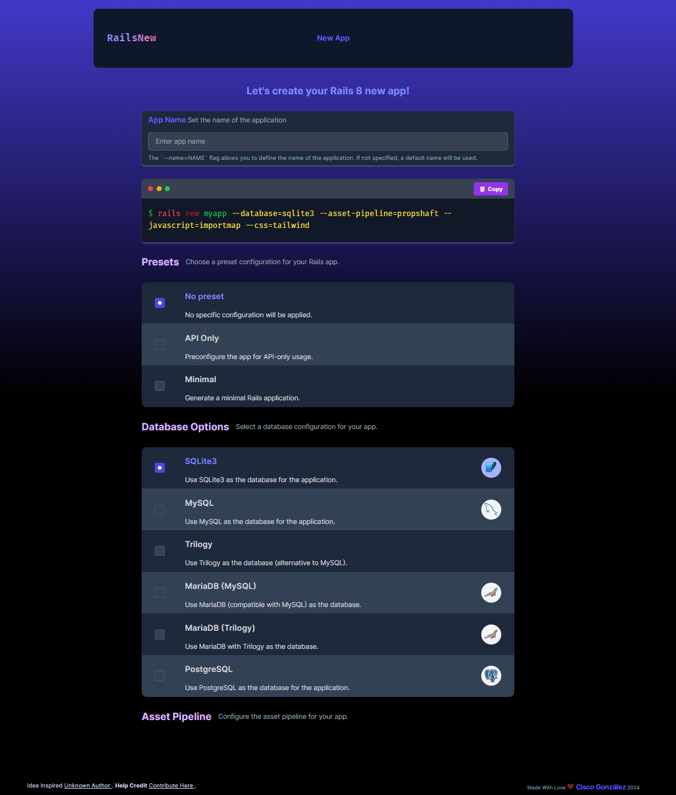

# RailsNew 🚀

Welcome to **RailsNew**, the perfect tool to streamline the creation of your next Ruby on Rails 8 application. Whether you're a seasoned developer or just starting out, **RailsNew** allows you to customize your setup effortlessly by selecting from a variety of configurations, all without leaving the convenience of your browser. 

Access the app here: [railsnew.dev](https://railsnew.dev) 🌐

For more information on Ruby on Rails, check out the official documentation [here](https://guides.rubyonrails.org/) 📚.

## Features ✨

- **Custom Command Generation** 🛠: Choose from a wide range of options and configurations to tailor your `rails new` command. Whether you want to include specific database support, JavaScript frameworks, or skip features like tests and housekeeping, **RailsNew** has got you covered.
  
- **Predefined Presets & Advanced Options** 🎛: Quickly select from popular presets or dive deep into advanced configurations for more granular control over the setup of your Rails application.

- **Interactive User Interface** 🖥: With our sleek and easy-to-use frontend, you can visualize your Rails command as you build it. Adjust your preferences on the fly and watch as the command updates in real time.

- **Effortless Export** 📋: Once you've customized your options, simply copy the generated command to your clipboard and use it to bootstrap your new Rails 8 project with confidence.

## How It Works 💡

1. **Visit [railsnew.dev](https://railsnew.dev)** to start building your `rails new` command.
2. **Choose Your Configurations** ⚙️: Select the frameworks, tools, and libraries you need. Customize your setup by checking/unchecking options or adding your own custom parameters.
3. **Generate Command** 🔄: Watch your command update as you make your selections.
4. **Copy & Execute** 🖱: Copy the final command and run it on your terminal to start building your Rails 8 application!

## Why Use RailsNew? 🤔

**RailsNew** is designed with simplicity and flexibility in mind. It removes the need to remember complex command-line options or to repeatedly consult documentation. Instead, you can focus on crafting the perfect Rails setup, tailored to your project’s needs in just a few clicks.

- **Boost productivity** ⏱: Spend less time setting up and more time coding.
- **Reduce errors** ✅: Avoid typos and configuration mistakes by using a reliable interface.
- **Stay up-to-date** 🔄: As Rails 8 evolves, RailsNew will ensure that the latest configurations and options are available for your use.

## Get Started 🏁

Head over to [railsnew.dev](https://railsnew.dev) now and start building your next Rails 8 app with ease!

  

## License

This project is licensed under the MIT License - see the [LICENSE](./LICENSE) file for details.

For more information, feel free to contact me:
- GitHub: [ciscoLegrand](https://github.com/ciscoLegrand)
- Email: [cisco.glez@creadix.es](mailto:cisco.glez@creadix.es)